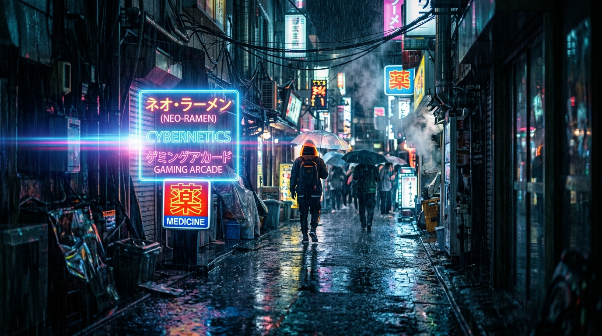
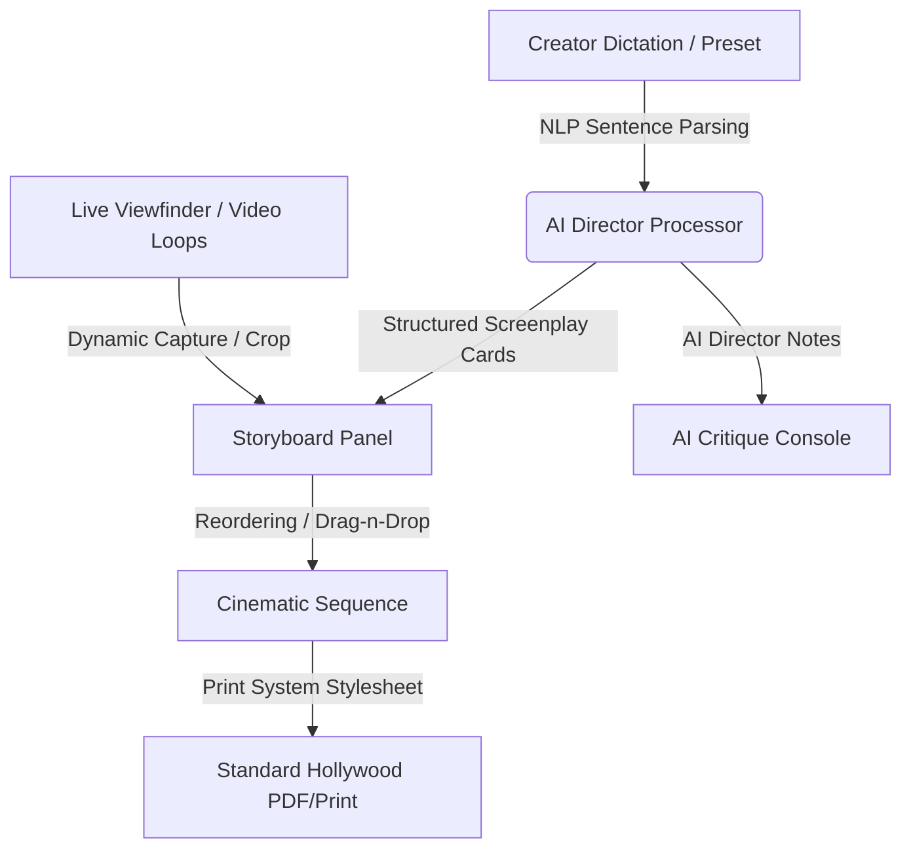

<div align="center">

# 🕶️ ScribeGlass

### Spatial Storyboard & Scriptwriting Suite for Creators & Directors
*Built for the **CUTC: Transform Hackathon 2026***

[](https://scribeglass.vercel.app/)
[](https://github.com/RaghavParasher/scribeglass)
[](https://react.dev/)
[](https://vite.dev/)

### 🚀 [**Launch ScribeGlass Web App**](https://scribeglass.vercel.app/)

<br />



</div>

---

## 💡 The Core Vision
With the rise of smart glasses (like Ray-Ban Meta) and spatial video, the creative workflow for video editing is still stuck in legacy 2D text files. Creators struggle to bridge raw text concepts with physical camera angles, shot grids, and audio elements. 

**ScribeGlass** is a smart, interactive viewfinder workspace. It translates raw script drafts into structured scene cards, drafts composition layouts, suggests automated director adjustments, and formats the entire sequence into print-ready Hollywood screenplays.

---

## 🛠️ Key Architectural Pillars

### 1. 🎥 Real-Time Cinematic Viewfinder HUD
*   **Offline Video Simulation**: Five local high-definition video loops served directly from local assets (**Cartoon Bunny**, **Playful Cat**, **Corgi Dog**, **Color Bars**, and **Historic Temple**) to avoid CORS hotlinking blocks and run offline.
*   **Hardware Focal Presets**: Simulates **24mm (Wide)**, **50mm (Standard)**, and **85mm (Telephoto)** ranges using smooth hardware CSS zoom transformations.
*   **Tap-To-Focus Reticle**: Interactive HUD crosshairs reposition dynamically on clicking inside the viewport.
*   **Cinematic Aspect Crops**: Toggle aspect masks (**16:9 TV**, **2.39:1 Film**, **9:16 Spatial**). Frame snapshots are stamped with selected crop lines in real-time.
*   **Frame Snapshot Engine**: Renders active video streams directly to an HTML5 canvas context, pushing frame captures to your active storyboard thumbnail instantly.

### 2. 🧠 AI Director's Critique & Pacing Analyst
*   **Pacing Index Gauge**: Displays a dynamic velocity score (0% to 100%) indicating the narrative speed of the scenes.
*   **Flow Classification**: Identifies pacing rhythm classes (e.g. *High Tension / Action*, *Slow / Melancholic*, *Instructional / Rhythmic*).
*   **Director's Suggestions**: An automated review console analyzing scene transitions (e.g., suggesting a tracking shot to smooth out quick actions or a close-up detail for heavy dialogue).

### 3. 🎬 Fluid Storyboard Workspace
*   **2D Framing Overlays**: Renders target lines representing compositions (**Rule of Thirds**, **Center Focus**, **Diagonal Motion**).
*   **Preset Script Templates**: Pre-loaded with beautiful, custom-generated cinematic thumbnail stills for immediate testing.
*   **HTML5 Sequence Drag & Drop**: Reorder shots on the fly using zero-dependency browser drag handles.
*   **Dynamic Card Editor**: Modify shot parameters, dialogue tags, and sound cues in-line.

### 4. 📜 Hollywood Script Formatter
*   Transforms storyboard sequences into standard screenplay scripts using Courier styling and exact spacing margins.
*   **Print Stylesheets**: Hides dashboard navigation controls completely when printing, outputting clean screenplay pages to PDF or printer paper.

---

## ⚙️ Technical Design Flow



---

## 🚀 Targeted Tracks

*   **Media & Creator Track**: Elevates traditional pre-production scripts into an active, visual storyboard timeline.
*   **Design & UI Track**: Features a futuristic cyber dark slate glassmorphism user interface designed with micro-interactions and accessibility.
*   **Apps Track**: Built as a zero-dependency React 19 Single Page Application, running entirely client-side using native browser capabilities.

---

## 💻 Local Setup & Installation

Get ScribeGlass running locally in seconds:

1. **Clone the repository:**
   ```bash
   git clone https://github.com/RaghavParasher/scribeglass.git
   cd scribeglass
   ```

2. **Install dependencies:**
   ```bash
   npm install
   ```

3. **Start the development server:**
   ```bash
   npm run dev
   ```
   Open your browser to `http://localhost:5173/` to view the application.

4. **Compile Production Bundle:**
   ```bash
   npm run build
   ```

---

<div align="center">
ScribeGlass is licensed under the MIT License. Developed for the CUTC Transform Hackathon 2026.
</div>
